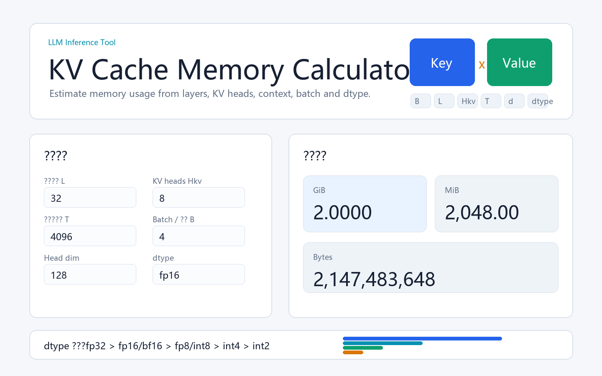

# KV Cache Calculator



一个面向 LLM Inference / AI Infra 学习者的 KV Cache 显存估算与可视化工具。它把 KV Cache 的核心成本模型做成一个可以直接打开的静态网页，方便对比 batch、上下文长度、KV heads 和 dtype 对显存的影响。

> A lightweight visual calculator for estimating LLM KV Cache memory usage across batch size, context length, KV heads, and dtype.

## Features

- 输入模型层数、KV head 数、上下文长度、batch、head dimension 和 dtype。
- 实时输出 KV Cache 理论显存：bytes、MiB、GiB。
- 支持 `fp32`、`fp16`、`bf16`、`fp8`、`int8`、`int4`、`int2`。
- 提供 dtype 显存对比条形图。
- 提供 MHA / GQA 的 KV heads 显存对比提示。
- 内置 GQA、MHA、长上下文、大 batch 快捷配置。
- 无需安装 npm、React、Vite 或任何前端依赖。

## Quick Start

方式一：直接用浏览器打开：

```text
index.html
```

方式二：使用 Python 启动本地静态服务：

```powershell
cd D:\WORKING\深圳大数据研究院\code\kv-cache-calculator
python -m http.server 8000
```

然后访问：

```text
http://localhost:8000
```

## Formula

```text
KV bytes = 2 * B * L * Hkv * T * d_head * bytes_per_elem
```

变量含义：

| Symbol             | Meaning                                          |
| ------------------ | ------------------------------------------------ |
| `2`              | Key 和 Value 两份缓存                            |
| `B`              | batch size 或并发序列数                          |
| `L`              | Transformer 层数                                 |
| `Hkv`            | KV head 数，GQA/MQA 通过减少它降低 KV Cache 显存 |
| `T`              | 上下文长度 / cached token 数                     |
| `d_head`         | 每个 attention head 的维度                       |
| `bytes_per_elem` | KV Cache dtype 对应的单元素字节数                |

## Supported dtype

| dtype    | bytes/element |
| -------- | ------------: |
| `fp32` |             4 |
| `fp16` |             2 |
| `bf16` |             2 |
| `fp8`  |             1 |
| `int8` |             1 |
| `int4` |           0.5 |
| `int2` |          0.25 |

## Example

默认参数：

```text
layers=32, kv_heads=8, context=4096, batch=4, head_dim=128, dtype=fp16
```

计算结果：

```text
2,147,483,648 bytes = 2,048 MiB = 2.0000 GiB
```

同样参数下：

- `fp8` 约为 `fp16` 的一半。
- `kv_heads=8` 约为 `kv_heads=32` 的四分之一。

## Project Structure

```text
kv-cache-calculator/
├── assets/
│   └── screenshot.png
├── app.js
├── index.html
├── styles.css
├── README.md
├── LICENSE
└── .gitignore
```

## Calculation Scope

该工具计算的是 decoder-only LLM self-attention KV Cache 的理论显存占用，不包含以下系统因素：

- page/block metadata
- allocator fragmentation
- CUDA workspace
- 模型权重显存
- activation 显存
- prefix cache 共享收益
- offload / 分布式 KV 传输成本

因此它适合作为推理资源估算和学习工具。真正部署时，还需要结合 vLLM、SGLang、TensorRT-LLM 等 serving engine 的实际内存管理策略做 benchmark。

## Roadmap

- 增加常见模型预设：Llama、Mistral、Qwen、DeepSeek 等。
- 增加 GPU 容量反推：给定显存预算，估算最大 batch 或最大 context。
- 增加 PagedAttention / block size 粗略估算。
- 增加 prefix cache 命中率对显存和吞吐的影响示意。
- 发布到 GitHub Pages，提供在线访问链接。

## License

MIT License
